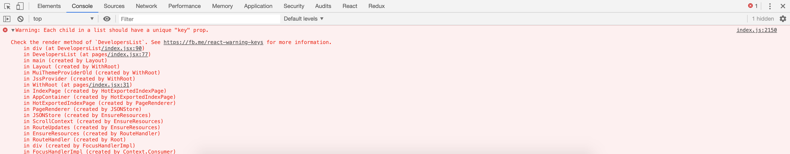

Key es una atributo que se debe pasar a todos los componentes que se crean dinámicamente, un ejemplo muy claro es cuando creamos componentes a partir de un array, ReactJs lo utilizará como identificador único para el DOM.

> Cuando se utilizan el atributo _key_, ReactJs se asegura que el componente no se cree nuevamente y conserva el existente.

Pero qué es lo que realmente hace ReactJs con el atributo _Key_, no necesariamente se trata del rendimiento si no más sobre la identidad que esto a su vez nos lleva a un mejor _rendimiento_ veamos un ejemplo.

### Implementado el atributo key en los componentes secundarios

```javascript
import React from 'react'

const FRUITS = [
  { id: 'fruit-1', name: 'banana' },
  { id: 'fruit-2', name: 'apple' },
  { id: 'fruit-3', name: 'orange' },
]

class Ejemplo extends React.Component {
  render() {
    return (
      <>
        {FRUITS.map(item => (
          <div>
            <div key={item.id}>{item.name}</div>
          </div>
        ))}
      </>
    )
  }
}
```

### Qué sucede si no pasamos el atributo **key** a los componentes secundarios

**ejemplo:**

```javascript
import React from 'react'

const FRUITS = [
  { id: 'fruit-1', name: 'banana' },
  { id: 'fruit-2', name: 'apple' },
  { id: 'fruit-3', name: 'orange' },
]

class Ejemplo extends React.Component {
  render() {
    return (
      <>
        {FRUITS.map(item => (
          <div>
            <div>{item.name}</div>
          </div>
        ))}
      </>
    )
  }
}
```

la consola arroja una advertencia sobre el atributo _key_



---

### Malas prácticas para el atributo **key**

**ejemplos:**

- malo

  ```javascript
  class Ejemplo extends React.Component {
    render() {
      return (
        <>
          {FRUITS.map((item, index) => (
            <div>
              <div key={index}>{item.name}</div>
            </div>
          ))}
        </>
      )
    }
  }
  ```

- malo

  ```javascript
  class Ejemplo extends React.Component {
    render() {
      return (
        <>
          {FRUITS.map((item, index) => (
            <div>
              <div key={{Math.random()}}>{item.name}</div>
            </div>
          ))}
        </>
      )
    }
  }
  ```

podría seguir con malas prácticas pero la idea es que entiendas, para qué y cómo usar el atributo _key_ en tus components de ReactJs.

> Este es un tema básico que te ayudará mucho cuando estés empezando con ReactJs.
